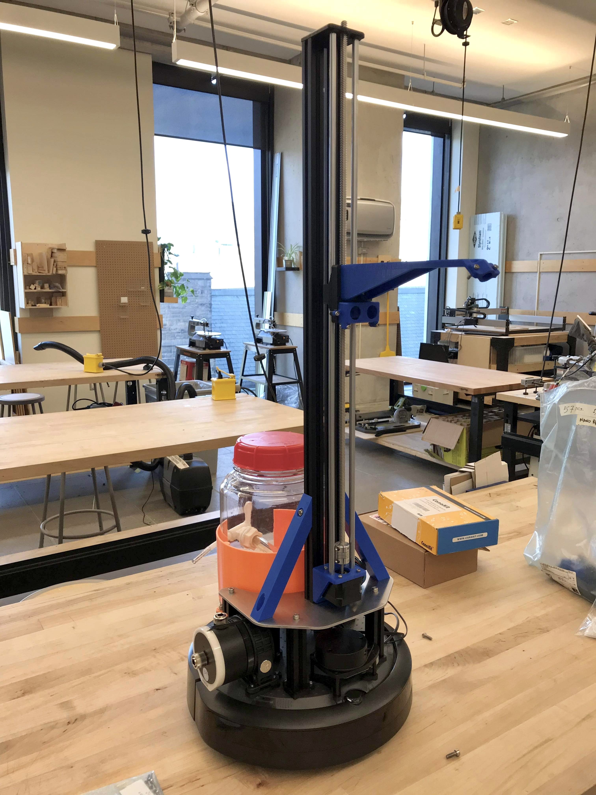
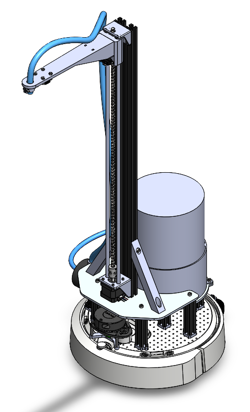

# Bloomba: An Autonomous Plant Watering Robot for The Office

<div align="center">
    <a align="center">
        </img>
        </img>
    </a>
</div>

## Setup

### Overview
The onboard Raspberry Pi will execute all packages related to sensor processing, SLAM, and navigation. A separate computer is required to visualize the operation of the robot via Rviz2 and send commands (graphically) to save map and navigate to waypoints. *As a future work, the execution of these commands can be written and further customized using API calls (see [slam_toolbox](https://github.com/SteveMacenski/slam_toolbox) and [Nav2](https://navigation.ros.org/commander_api/index.html) documentation) and offloaded to the Raspberry Pi.* 

### On computer:
1. Install [Ubuntu 22.04](https://releases.ubuntu.com/jammy/) (Jammy Jellyfish) on computer
2. Install [ROS 2 Humble](https://docs.ros.org/en/humble/Installation/Ubuntu-Install-Debians.html) on computer

### On Create 3 and Raspberry Pi:
1. Power on the Create 3
2. Connect the Raspberry Pi to a monitor/keyboard/mouse
3. **Install Ubuntu and ROS 2 on the Pi (No need to do this because the robot will be delivered with these pre-installed; Only do this if reinstalling from scratch)*
4. Setup a Wifi connection on the Pi
5. Setup git and clone this repository onto the Pi via `git clone git@github.com:splouisliu/bloomba.git`
6. Find the local IP address of the Pi and SSH into it from the computer
7. Setup the [Create 3](https://edu.irobot.com/create3-setup) and ensure that it's connected to the same Wifi network as the Pi (Can only connect to 2.4GHz Wi-Fi networks).

You should now have access to two ROS environments via the terminals of the computer: the computer itself, and the Pi (SSH'd in)

## Execution

Refer to the below ROS2 commands for this section:
1. On both the computer and the Pi, execute all **Basic** commands
2. On the Pi, execute **SLAM bringup (live robot)**
3. On the computer, execute **rviz2**
4. Open another terminal and execute *teleop*. Use this to drive the robot around the office to build a map
5. Once the map is complete, find the slam_toolbox plugin in Rviz2 to save the map. The map will be saved as two files located in the workspace directory of the Pi: `EXAMPLE.pgm` and `EXAMPLE.yaml`.
6. SLAM is now complete. Close the terminal running the code.
7. To navigate, execute **Navigation bringup (live robot)** using the following command: `ros2 launch bloomba_bringup live_nav_launch.py map:=EXAMPLE.yaml`
8. Using the Nav2 plugin, first estimate the pose of the robot's initial location. A set of green dots should appear. If they don't relaunch the code.
9. Next, set waypoints via drag-and-drop for the robot to navigate towards!


## ROS2 Commands
### Basics

Enter workspace:

`cd <INSERT PATH>/bloomba/bloomba_ws`

Build (on PC):
```
rosdep install --from-path src -yi
colcon build --symlink-install
```

Build (on live robot):
```
rosdep install --from-path src/bloomba_bringup src/bloomba_navigation src/bloomba_slam -yi
colcon build --symlink-install --packages-select bloomba_bringup bloomba_navigation bloomba_slam
```

Source:

`source install/local_setup.bash`


### Bringup commands

Run SLAM bringup (on PC):

`ros2 launch bloomba_bringup sim_slam_launch.py`

Run navigation bringup (on PC):

`ros2 launch bloomba_bringup sim_nav_launch.py`

Run SLAM bringup (on live robot):

`ros2 launch bloomba_bringup live_slam_launch.py`

Run navigation bringup (on live robot):

`ros2 launch bloomba_bringup live_nav_launch.py`


### Standalone Commands

Run sim (on PC):

`ros2 launch irobot_create_gazebo_bringup create3_gazebo_office.launch.py use_rviz:=false spawn_dock:=false`

Run lidar (on live robot):
`ros2 launch bloomba_bringup sensors_launch.py`

Run laser filters:

`ros2 launch bloomba_bringup laser_filters_launch.py`

Run teleop:

`ros2 run teleop_twist_keyboard teleop_twist_keyboard`

Run slam:

`ros2 launch bloomba_slam online_async_launch.launch.py`

Run rviz:

`ros2 launch bloomba_bringup rviz_launch.py`

Run navigation:

`ros2 launch bloomba_navigation bringup_launch.py map:="maps/map_office_sim.yaml"`

Run rosbridge:

`ros2 launch rosbridge_server rosbridge_websocket_launch.xml`

Visualize TF:

`ros2 run tf2_tools view_frames`
